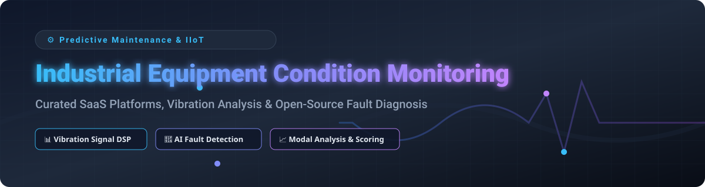

  
  
  
  
  

  

# ⚙️ Awesome Industrial Equipment Condition Monitoring

> **Curated Ecosystem of Commercial SaaS Platforms & Open-Source Tools for Vibration Analysis, AI Fault Diagnosis, Structural Health Monitoring & Predictive Maintenance (PdM).**

---

## 🔍 Overview & Market Analysis

This repository tracks notable **commercial condition monitoring platforms**, **industrial AI frameworks**, and **open-source signal processing toolkits** that monitor machinery health via vibration, temperature, acoustic, and process telemetry — from fully managed enterprise IIoT sensor suites to self-hosted diagnostic frameworks.

### 📈 Market Size & Industry Dynamics

> 💡 **Market Size**: The Global Industrial Condition Monitoring Market is estimated at **~$12.8 Billion in 2026** (projected to reach **$18.5 Billion by 2030** at a **7.8% CAGR**), driven by rapid IIoT adoption, industrial AI diagnostics, and asset performance management (APM) mandates across manufacturing, energy, and aerospace.  
>
> 🧩 **Market Fragmentation**: The sector is **moderately fragmented**, featuring established industrial automation giants (AWS, Schneider Electric, ABB, Emerson, GE Vernova, Fortive/Fluke) alongside high-growth specialized AI "diagnostics-as-a-service" unicorns (such as Augury and Samsara). High upfront hardware sensor requirements and proprietary fieldbus integrations currently prevent a single "winner-take-all" outcome, allowing specialized open-source frameworks and niche SaaS offerings to thrive.

---

## 📋 Table of Contents

- [🏢 SaaS & Hosted Commercial Platforms](#-saas--hosted-commercial-platforms)
- [🔓 Open-Source GitHub Projects](#-open-source-github-projects)
  - [⚡ Vibration Analysis & Signal Processing Toolkits](#-vibration-analysis--signal-processing-toolkits)
  - [🛠️ Fault Detection & Diagnosis Frameworks](#%EF%B8%8F-fault-detection--diagnosis-frameworks)
  - [🤖 LLM-Integrated & AI Diagnostics](#-llm-integrated--ai-diagnostics)
  - [📊 Health Scoring & Bayesian Fusion Engines](#-health-scoring--bayesian-fusion-engines)
- [⭐ Star History](#-star-history)
- [💖 Support & Sponsorship](#-support--sponsorship)
- [🤝 How to Contribute](#-how-to-contribute)
- [⚠️ Disclaimer](#%EF%B8%8F-disclaimer)

---

## 🏢 SaaS & Hosted Commercial Platforms

*Sorted by Parent Company Size / Market Capitalization (Descending)*

| Platform | Description & Focus | Starting Pricing | Free Tier / Free Trial Limit | Company Size (Market Cap / Revenue / Valuation) |
| :--- | :--- | :--- | :--- | :--- |
| **[Amazon Monitron](https://aws.amazon.com/monitron/)** ☁️ | AWS managed end-to-end condition monitoring using sensors, gateways & ML models for rotating equipment. | $4.17/sensor/month ($50/sensor/year) service fee + hardware purchase ($50 per sensor, ~$140 per gateway). | No free trial; hardware purchase required for setup. | **~$2.1 Trillion Market Cap** (Amazon / AWS Parent) |
| **[Schneider Electric EcoStruxure](https://www.se.com/)** ⚡ | IoT-enabled architecture for asset management, predictive maintenance & energy monitoring. | Tiered per-device/server license model ("Pay as You Grow"). | 30-day full feature free trial for EcoStruxure IT Expert & Control Expert modules. | **~$135 Billion Market Cap** (~€38B Annual Revenue) |
| **[ABB Ability Genix](https://www.abb.com/)** 🏭 | Industrial analytics & AI platform for cross-functional asset performance monitoring. | Enterprise subscription tier starting via ABB Ability Marketplace (min 3-year term). | Interactive trial packages available on request via ABB Ability Marketplace. | **~$95 Billion Market Cap** (~$32B Annual Revenue) |
| **[GE Digital APM](https://www.ge.com/digital/applications/asset-performance-management)** ✈️ | Asset Performance Management suite offering predictive analytics and reliability strategy. | Modular enterprise subscription based on monitored asset count and active feature modules. | Guided sandbox trial environment provided via GE Digital sales representatives. | **~$70 Billion Market Cap** (GE Vernova Parent) |
| **[Emerson AMS Machine Works](https://www.emerson.com/)** ⚙️ | Machinery health management software providing vibration analysis & balancing diagnostics. | Annual tag-based subscription or perpetual license starting from authorized Emerson reps. | Demo / proof-of-concept environment available via Emerson account managers. | **~$62 Billion Market Cap** (~$17.5B Annual Revenue) |
| **[Samsara Industrial IoT](https://www.samsara.com/)** 🚛 | Connected operations platform for equipment monitoring, fleet telematics & industrial IoT data. | ~$27 - $60 per vehicle/asset/month + hardware gateways ($99-$548 upfront, 3-year min contract). | 30-day risk-free hardware & platform evaluation return window. | **~$24.8 Billion Market Cap** (~$1.85B TTM Revenue) |
| **[Fluke Reliability eMaint](https://www.fluke.com/)** 🛠️ | Enterprise CMMS platform integrating vibration monitoring and asset health tracking. | $69/user/month (Team Plan, min 3 users, billed annually). | Free sales demo sandbox trial available upon request. | **~$17.4 Billion Market Cap** (Fortive FTV Parent) |
| **[SKF Enlight](https://www.skf.com/)** 🔄 | Machinery analytics & vibration sensor platform for rotating equipment health management. | Quote-based OPEX subscription (bundles sensors, software & remote diagnostics). | SKF QuickCollect companion app is free forever for basic handheld sensor readouts. | **~$11 Billion Market Cap** (~SEK 103B Annual Revenue) |
| **[Augury](https://augury.com/)** 🧠 | Machine health platform delivering continuous vibration, temp & magnetic AI diagnostics as DaaS. | ~$50 - $150 per machine/month (billed annually per monitored asset). | No free trial; custom enterprise onboarding and site evaluation required. | **>$1.0 Billion Valuation** (Unicorn, $369M total raised) |
| **[SPM Instrument](https://www.spminstrument.com/)** 📡 | Comprehensive condition monitoring hardware and software (Condmaster) for shock pulse & vibration. | Custom project-based quote (hardware data loggers + software licensing). | On-site demonstration & evaluation trial period via local SPM representatives. | **Mid-Market Private** (~$50M+ Annual Revenue) |

---

## 🔓 Open-Source GitHub Projects

*Sorted by GitHub Stars_Count (Descending)*

### ⚡ Vibration Analysis & Signal Processing Toolkits

- **[Rotating-machine-fault-data-set](https://github.com/hustcxl/Rotating-machine-fault-data-set)**   
  **Open rotating mechanical fault datasets collection** — Comprehensive repository of open-source bearing and gearbox vibration benchmark datasets for diagnostic algorithm evaluation.

- **[weibull-knowledge-informed-ml](https://github.com/tvhahn/weibull-knowledge-informed-ml)**   
  **Knowledge-informed machine learning on PRONOSTIA (FEMTO) and IMS bearing datasets** — Combines physics-informed Weibull distributions with ML models for Remaining Useful Life (RUL) estimation.

- **[ABRAVIBE Toolbox](https://github.com/anderstorrence/ABRAVIBE)**   
  **MATLAB/GNU Octave toolbox for teaching and practicing vibration analysis and structural dynamics**, GPL licensed — Comprehensive functionality for mechanical model simulation, spectral analysis, order tracking, and modal parameter extraction.

- **[PyOMA](https://github.com/dagghe/PyOMA)**   
  **Open-source Python module for Operational Modal Analysis (OMA)** — Features SSI-Cov, FDD, and EFDD algorithms for ambient vibration analysis of civil structures and machinery.

- **[pyOMA2](https://github.com/dagghe/pyOMA2)**   
  **Next-generation Python toolbox for Operational Modal Analysis**, developed at Bauhaus-Universität Weimar — Interactive GUI (PyQt6/Jupyter) with 3D VTK mode shape rendering and multi-setup data merging.

- **[oma-python](https://github.com/Dynoma/oma-python)**   
  **Operational Modal Analysis algorithms for Python**, MIT licensed — Estimates natural frequencies, damping ratios, and mode shapes using FDD and Covariance-driven SSI.

---

### 🛠️ Fault Detection & Diagnosis Frameworks

- **[cbm_codes_open](https://github.com/biswajitsahoo1111/cbm_codes_open)**   
  **Python and MATLAB code implementing machine learning algorithms for machinery condition monitoring** — Data processing pipeline for bearing fault diagnosis using CWRU dataset.

- **[OpenConMo](https://github.com/Aalto-Arotor/openconmo)**   
  **Python library for vibration signal-based condition monitoring**, developed at Aalto University — Enables reproducible vibration research with automated CWRU dataset downloading and signal benchmark notebooks.

- **[FD-REST](https://github.com/Fraunhofer-IMS/FD-REST)**   
  **Lightweight RESTful platform for real-time fault detection and diagnosis in industrial systems**, Fraunhofer IMS — Dockerized architecture with DNN inference and REST API for secure on-premises deployment.

- **[Rotary Insight](https://github.com/rotary-insight/rotary-insight)**   
  **Open-source deep learning framework for rotary machinery bearing fault diagnosis** — Automated preprocessing, spectrogram visualization, and REST-based classification server.

- **[Bearing-FDD](https://github.com/paolocalderaro/bearing-fdd)**   
  **Explainable bearing fault diagnosis using Monotonic Smoothed Stacked Autoencoders (MS2AE)** — Kurtogram-guided bandpass filtering and DTW baseline generation for early fault stage determination.

---

### 🤖 LLM-Integrated & AI Diagnostics

- **[claude-stwinbox-diagnostics](https://github.com/LGDiMaggio/claude-stwinbox-diagnostics)**   
  **Condition monitoring copilot and predictive maintenance AI agent** — Connects industrial MEMS sensors to Claude via MCP (Model Context Protocol) with ISO 10816/20816 vibration severity checking.

---

### 📊 Health Scoring & Bayesian Fusion Engines

- **[JOR 4.0 Predictive Maintenance Fusion Engine](https://github.com/jamesorion6869/JOR_PYMC_V3_1)**   
  **Recursive Bayesian framework with ISO 20816-3 compliance** — Evidence fusion engine calculating Non-Healthy Probability (NHP) and hysteresis alerts under NEMA MG-1 thermal limits.

- **[machine-health](https://pypi.org/project/machine-health/)**  
  **Unified 0-100 machine health score Python library** — Evaluates stability, compliance, anomaly rate, and availability into an explainable letter grade (A-F).

---

## ⭐ Star History

---

## 💖 Support & Sponsorship

If you find this repository valuable for your predictive maintenance projects, research, or industrial IoT engineering, please consider supporting the project:

- ⭐ **Star this repository** to increase visibility on GitHub!
- 🔀 **Fork & Share** it with your reliability engineering peers.
- ☕ **Sponsor the Maintainer**: Support ongoing curation and open-source maintenance via [GitHub Sponsors](https://github.com/sponsors/ishandutta2007).

---

## 🤝 How to Contribute

Contributions are welcome! Please follow these simple guidelines:

1. Fork this repository.
2. Edit `README.md` following the table / list schema.
3. Include: Project name, official URL, concise description, and pricing/stars information.
4. Ensure no broken links and submit a Pull Request.

Refer to the main curated directory on [Awesome-Awesome-Awesome](https://github.com/ishandutta2007/Awesome-Awesome-Awesome) for more curated tech indexes.

---

## ⚠️ Disclaimer

- This repository is a **community-curated index** for informational and educational purposes.
- Industrial condition monitoring systems process sensitive operational telemetry; deployment of open-source tools in safety-critical manufacturing environments must comply with **IEC 62443** cybersecurity standards and relevant **ISO 10816 / 20816** vibration guidelines.
- Always verify open-source software licenses before commercial deployment.

---

  <b>Made with ❤️ for maintenance engineers, reliability professionals, and industrial IoT innovators.</b>

